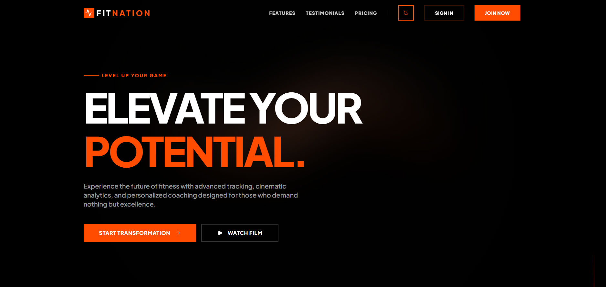
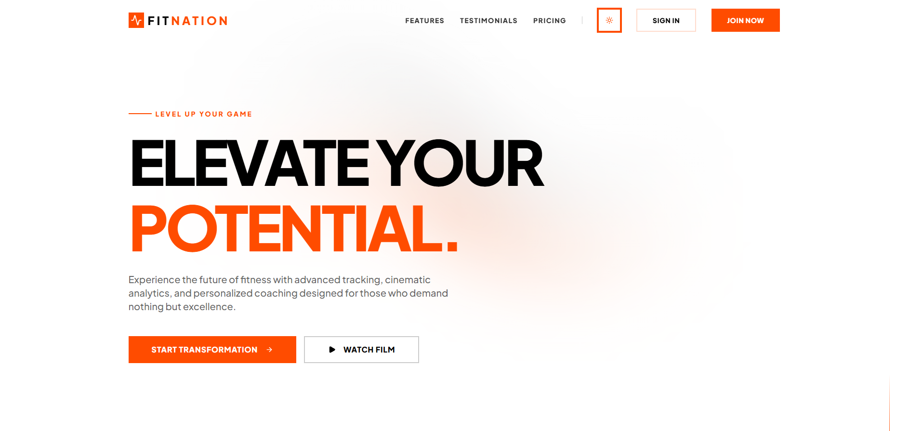
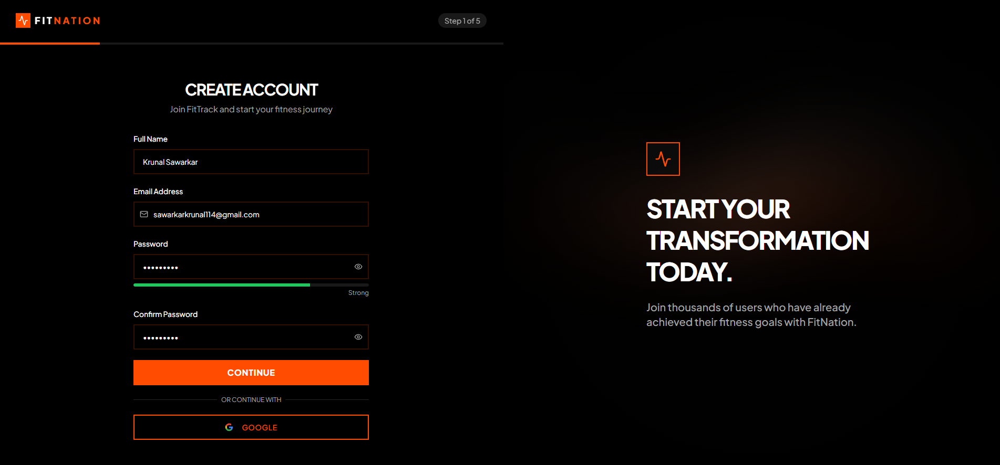
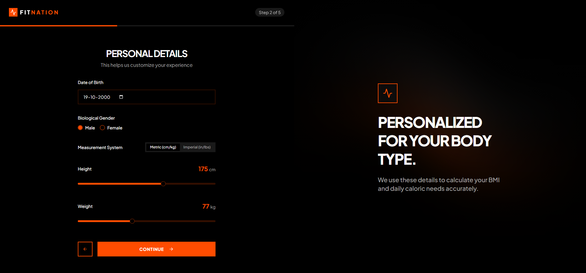
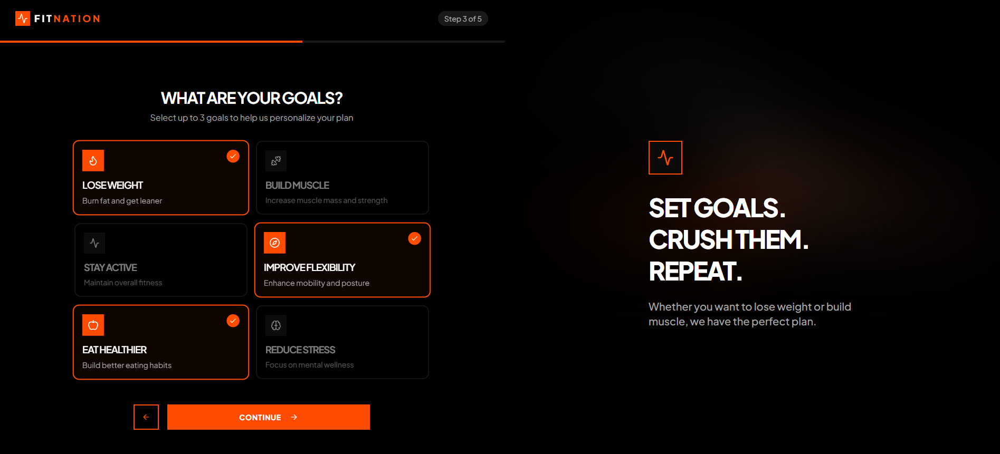
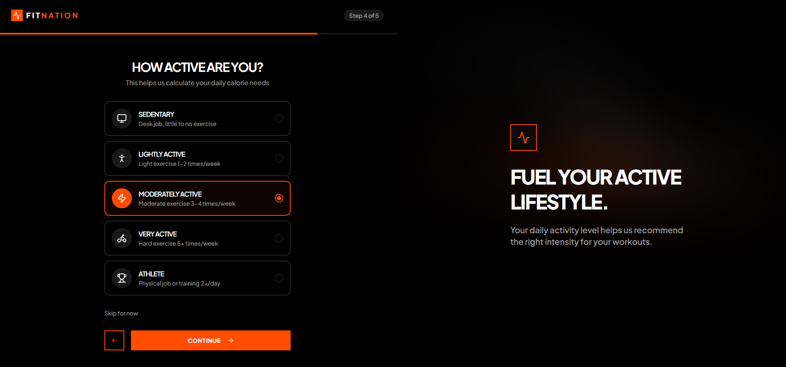
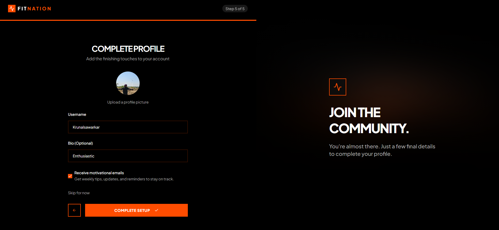
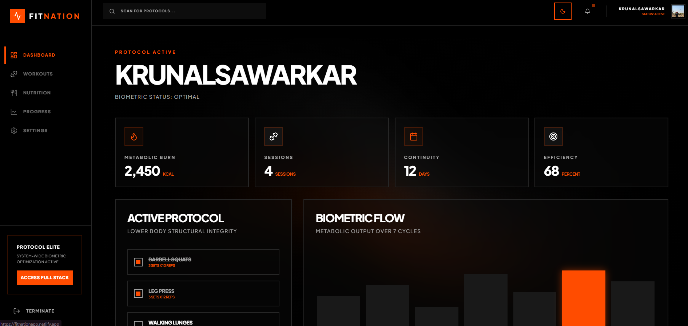

# FitNation — Architectural Fitness & Wellness Platform

FitNation is a premium, high-performance fitness platform engineered for surgical precision. It features a cinematic user interface, organic motion effects, and a robust biometric design system.

[](https://fitnationapp.netlify.app/)

---

## 📸 Visual Gallery

### 1. Cinematic Landing Page
The landing page features a motion-driven hero section with "Masked Heading" emergence and organic light trails that react to the current theme.

| Dark Mode (Architectural) | Light Mode (Clean) |
| :---: | :---: |
|  |  |

- **Dynamic Theming**: Seamless switching between High-Contrast Dark and Pure Light modes.
- **Motion Backgrounds**: Interactive SVG trails that provide depth and cinematic energy.

### 2. Biometric Onboarding Flow
A multi-step, strictly validated flow built with **React Hook Form** and **Zod**.

| Step 1: Identity | Step 2: Biometrics | Step 3: Protocols |
| :---: | :---: | :---: |
|  |  |  |

| Step 4: Activity | Step 5: Finalize |
| :---: | :---: |
|  |  |

- **Protocol Selection**: Goal-oriented selection (Weight Loss, Muscle Build, Flexibility) with architectural cards.
- **Biometric Calibration**: Precision sliders for height and weight calibration.

### 3. Protocol Command Center (Dashboard)
A high-fidelity interface for biometric monitoring and activity orchestration.



- **Metabolic Burn Tracking**: Real-time caloric output visualization.
- **Biometric Flow**: 7-cycle metabolic output analytics.
- **Active Protocol**: Direct management of structural integrity workouts.

---

## 🛠 Tech Stack
- **Frontend**: React 18, Vite, TypeScript
- **Styling**: Tailwind CSS (Custom Design System)
- **Animations**: Framer Motion (Organic motion & transitions)
- **State Management**: Zustand (Biometric persistence & Theme control)
- **Form Handling**: React Hook Form + Zod (Strict schema validation)
- **Icons**: Lucide React
- **Deployment**: Netlify (with SPA routing optimization)

---

## 🎨 Design Decisions
- **Architectural Aesthetic**: "Elite Performance" vibe. Uses pure `#000000` black and `#FFFFFF` white backgrounds with vibrant `#FF4D00` (Safety Orange) accents.
- **Geometry**: Sharp architectural edges (`border-radius: 0`) across all cards and buttons to represent structural integrity and precision.
- **Motion System**: Organic, fluid light trails in the background that adapt to theme changes, providing a "living" UI that feels reactive and alive.
- **Theme Engine**: A robust CSS-variable-based system with `color-scheme: dark` support, ensuring native-feeling UI controls.

---

## 🏗 Component Architecture & Reusable Patterns

### 1. Architecture: Feature-Based Domain Isolation
The codebase follows a modular feature-based structure to ensure scalability and maintainability:
- **`src/features/`**: Contains self-contained modules (Auth, Dashboard, Landing) with their own components, logic, and sub-features.
- **`src/components/ui/`**: A library of atomic, stateless UI components following consistent design tokens.
- **`src/store/`**: Centralized global state management using Zustand for biometric data and theme persistence.

### 2. Reusable Patterns
- **HOC Theme Injection**: A custom `ThemeProvider` context pattern that injects theme state and native `color-scheme` support across all UI layers.
- **Biometric Input Patterns**: Reusable custom slider and radio group patterns designed for ergonomic biometric data entry.
- **Kinetic Backgrounds**: A centralized `MotionBackground` component used across onboarding and landing pages to provide visual continuity.
- **Schema-Driven Validation**: A recurring pattern of using Zod schemas coupled with React Hook Form for robust, type-safe data entry protocols.

---

## 🚀 Local Development

1. Clone the repository:
   ```bash
   git clone git@github.com:Krunalsawarkar/fitnation_app.git
   ```
2. Install dependencies:
   ```bash
   npm install
   ```
3. Start the development server:
   ```bash
   npm run dev
   ```

---
**Engineered with Precision by [Krunal Sawarkar](https://github.com/Krunalsawarkar)**
